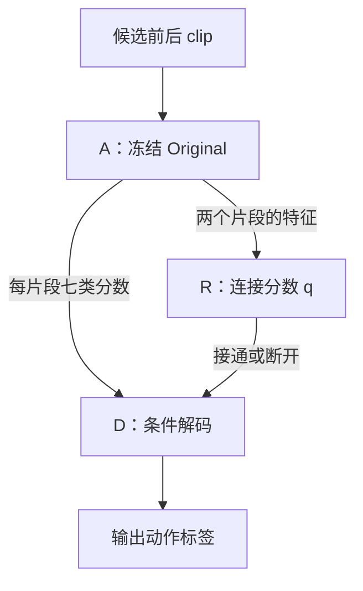

# A–R–D 代码原型

本目录实现的是**冻结 Original、单独学习连接判断、再条件解码**。目前只有代码检查与合成数据测试，没有真实 R 的训练结果，不能把以前 v3 的成绩算成这个新方法的成绩。它不会给无序 clip 重建临床顺序，也不改现有训练 launcher。

## 三个模块怎样接起来

| 模块 | 代码 | 输入 → 输出 | 是否训练 |
|---|---|---|---|
| A | `evidence.py` | 每个 clip 的 36 张缓存帧 → 七类 logits、8 个全局 token、12 个局部 token及位置 | 加载已 finetune 的 Original；全部冻结 |
| R | `network.py` | 候选前后两个 clip 的全局和局部特征 → 一个连接二分类 logit，sigmoid 得到 q | 用人工复核的 C/D 连接训练；U 不进入 loss |
| D | `decoder.py` | 已声明顺序的七类 logits、训练转移表、R 的 q → 联合动作预测 | 不反向传播；转移表仅由训练 C 边的动作标签统计 |



例如三个播放片段排为 1、2、3，R 认为 1→2 可信，2→3 不可信：D 只联合判断前两个，第 3 个独立分类。**动作类别改变也可以是可信连接；相同动作来自不同操作也可以是不可信连接。** R 不能用“两个动作标签相同”代替连接标注。

## A：保持 Original 的预测

`FrozenOriginalEvidence` 通过临时 hook 读取全局 CNN 返回的逐帧 1280 维特征，以及局部 ResNet50 的 avgpool 2048 维特征；没有替换 forward，没有启用失败的局部模块。全部参数冻结，BN/dropout 始终 eval，hook 在异常后也会移除。

输入保持原来的 `36 / 8 / 12 / 128`：36 张缓存帧，8 张全局帧，12 张策略选择局部帧，128 crop。`load_original` 严格加载已训练 Original 的七分类 `best.pt["model"]`，不会用 SSv2 权重重新初始化分类头。

当前 R 的时序分支读取**已采样全局 token 的末端/首端**。它不是另读原视频最后/最初 0.5 秒的精准边界窗口；缓存位置只是归一化的缓存下标，不是经核验的 PTS。网络剪辑可能发生在未采样画面中，这个版本会漏掉证据。若验证表明这些特征不足，再增加经过核验的真实边界窗口。

## R：先给简单基线，再验证复杂分支

两种模式都将全局 1280、局部 2048 维投影到 64 维。分别取均值，对两侧构造 `[left, right, |left-right|, left*right]` 配对特征，以 MLP 输出连接证据。保留 left/right 使方向可以影响预测。

- `mlp`：仅以上场景与局部配对。默认 **291,521** 个可训练参数。
- `dual`：再加入前片段末两个和后片段首两个全局采样 token、片段侧别和位置嵌入，用一层 Transformer 融合。默认 **391,297** 个可训练参数。

网络只接收特征和缓存位置，所有输入自动 detach。七类 logits、人工动作标签、医院/网络来源、clip ID、文件路径都不进入 R。两种模式使用相同 C/D 标注，`dual` 需要证明优于简单 `mlp` 才有增加这一分支的依据。

## D：断开就不传播流程先验

候选连接许可 `eligible` 与 R 的临床可信度分开：前者由调用者声明同一录制组中的播放相邻关系，后者由 R 预测。**缺少 eligible 默认全部断开**；不能凭 clip 文件名、列表位置或相同来源自动连起来。推理不读取 C/D/U 标注。

默认 hard 模式：eligible 为真且 q≥阈值时接通，否则断开。阈值 0.9 是原型默认值，未校准，不表示已得到 90% 可信保证。soft 模式只用于对照：eligible 边用 r=q，忽略 hard 阈值。

对前一个标签 i、当前标签 j，D 的连接分数为：

\[
\psi_t(i,j)=\lambda\log\left[(1-r_t)+K r_t T_{ij}\right],\quad K=7.
\]

用视觉分数与这些连接分数做 Viterbi。r=0 时所有标签对的分数为 0；断开处没有信息传播。起始项采用均匀先验，所以**全部断开、单 clip、λ=0 时，标签与同一个 A checkpoint 的 argmax 完全一致，包括平局规则**。r=1 时等价于 transition-only 解码，仍不同于旧 v3 的非均匀起始先验版。

`--potential-bound` 可限制加权连接分数，但这不是“保证不会误改强视觉证据”的证明；默认未启用。阈值、λ、上限均应在开发集固定，再看锁定测试。q 表示学习到的连接可信度，不代表“D 一定能改对”。

## 标注与文件协议

必须复核原视频或可靠记录，不能自动把医院当 C、网络当 D。

| 标注 | 含义 | 训练用途 |
|---|---|---|
| C | 同一次操作、可信正向顺序、间隔适合统计的 clip 转移 | R 正例；D 训练转移统计 |
| D | 已知不满足上述连接，如跨操作、倒序或不适合该流程先验的拼接 | R 负例 |
| U | 无法确认 | 不进 BCE；只报告激活比例，不当作负例 |

`group_id` 表示用于隔离的录制/操作组，train/val 不得重合；跨文件但确认同操作时应事先统一复核分组。病人重复出现、同平台转载重复视频等仍须在数据准备阶段检查，本原型不能自动识别。C 必须在同一声明组；D/U 可以跨组，但两个端点必须属于同一划分。

导出后的 `index.jsonl` 每行示意：

```json
{"clip_id":"c01","group_id":"operation01","split":"train","feature_path":"features/c01.npz","checkpoint_sha256":"<真实64位SHA>","feature_sha256":"<真实64位SHA>","position_basis":"cache_index_fraction_not_verified_pts","label_id":0}
```

真实导出文件用 clip ID 的 SHA 命名。每个 npz 保存 `logits[7]`、`global_tokens[8,1280]`、`local_tokens[12,2048]`、`global_positions[8]`、`local_positions[12]`。动作 label_id 仅用于统计 D 的训练转移，不送进 R。

`edges.jsonl` 示例（这些是格式示例，不是已经存在的真实标注）：

```json
{"edge_id":"e01","left_clip_id":"c01","right_clip_id":"c02","split":"train","status":"C"}
{"edge_id":"e02","left_clip_id":"c03","right_clip_id":"c04","split":"train","status":"D"}
{"edge_id":"e03","left_clip_id":"v01","right_clip_id":"v02","split":"val","status":"U"}
```

需要同来源难例：同一操作动作变化的 C、换镜头仍连续的 C、相同动作跨操作的 D、同操作倒序的 D。若所有正例来自医院、所有负例来自网络，R 可能只学到来源差异。重复/冲突配对、跨 train/val 边、缺失局部特征、混用 A checkpoint、已存在输出目录都将报错。

## 运行顺序

使用已经能运行仓库 Original 的 Python/PyTorch 环境。以下路径为占位符；不会自动启动四卡或改现有缓存/清单。代码不硬编码 7372/823 或内部划分，按传入清单读取，并检查 group 隔离。若旧 823 已反复用于调参，仍是开发集，不能称独立 test。

1. 跑检查。

```bash
python -m unittest discover -s tests -p 'test_relation*.py'
```

2. 从同一个已训练 Original 导出 train/val 的特征。

```bash
python -m experiments.relation.export \
  --checkpoint /path/to/original/best.pt \
  --train-manifest /path/to/train.jsonl \
  --val-manifest /path/to/val.jsonl \
  --cache-root /path/to/full_cache_36f224_trainval \
  --output /path/to/fresh_relation_features --device cuda:0
```

3. 准备真实 C/D/U 标注后，只训练 R。先做 mlp，再在相同标注和预算下做 dual。需要 train、val 均有 C 和 D。

```bash
python -m experiments.relation.train \
  --index /path/to/fresh_relation_features/index.jsonl \
  --edges /path/to/edges.jsonl --output /path/to/fresh_relation_mlp \
  --mode mlp --device cuda:0 --seed 42

python -m experiments.relation.train \
  --index /path/to/fresh_relation_features/index.jsonl \
  --edges /path/to/edges.jsonl --output /path/to/fresh_relation_dual \
  --mode dual --device cuda:1 --seed 42
```

输出 `protocol.json`、`history.json`、`best.pt`、`metrics.json`；按 val C/D BCE 选 checkpoint，并报告给定阈值的 precision/recall/激活比例以及 U 激活比例。这里没有完成独立的概率校准，没有拿 U 充当校准负例。

4. 只统计训练 C 边的七类转移。

```bash
python -m experiments.relation.fit_transition \
  --index /path/to/fresh_relation_features/index.jsonl \
  --edges /path/to/edges.jsonl --output /path/to/fresh_trusted_transition
```

5. 推理另外提供 `chains.jsonl`，只写已知播放顺序和候选连接许可，不含临床连接真值。孤立或未知顺序 clip 不接通。

```json
{"chain_id":"s01","ordered_clip_ids":["v01","v02","v03"],"eligible":[true,true]}
{"chain_id":"single01","ordered_clip_ids":["v04"],"eligible":[]}
```

```bash
python -m experiments.relation.infer \
  --index /path/to/fresh_relation_features/index.jsonl \
  --relation-checkpoint /path/to/fresh_relation_dual/best.pt \
  --transition /path/to/fresh_trusted_transition \
  --chains /path/to/chains.jsonl --output /path/to/fresh_relation_predictions \
  --device cuda:0 --mode hard --threshold 0.9 --strength 1
```

当前 CLI 明确只对开发 val 推理；它不自动读取 test。输出包含每条边的 q、实际激活状态、A 标签、D 标签和改动位置，便于配对检查。数据、特征、标注、逐 clip 预测、原始日志和权重留在私有服务器，GitHub 只放代码与去身份聚合。

## 完成与尚缺的部分

已实现 A 特征读取、MLP/dual R、train-only 转移拟合、hard/soft D、标注/缓存检查、R 单独训练、显式候选链推理。测试覆盖真实但未训练 Original 的 CPU forward/logit 一致性、梯度隔离、穷举解码、断链回退、U 屏蔽和合成训练→重载→解码。

还没有真实连接标注训练、3090 CUDA 验证、概率校准、真实拼接/连续数据性能、新独立测试集或方法创新结论。正式实验至少比较同一个 A 上的 A-only、无门控 transition-only、MLP gate、dual gate、简单视觉相似度/镜头切换 gate；人工 C 边开关只能作为 oracle 对照，不能代替 R。

同时报告连接误接率、七类 P/R/F1、再灌注召回、改对/改错、医院/网络和连续/拼接/未知分层。重新清洗转移表本身也可能改变分数，需要与学习 gate 的贡献分开。即使 q 很高，重复动作、隐藏剪辑与缺乏时间证据仍可能不可判别，不能承诺自动恢复真实临床顺序。
