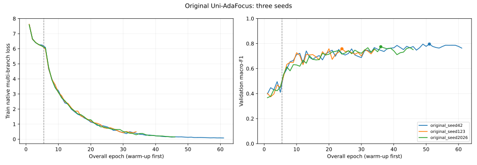
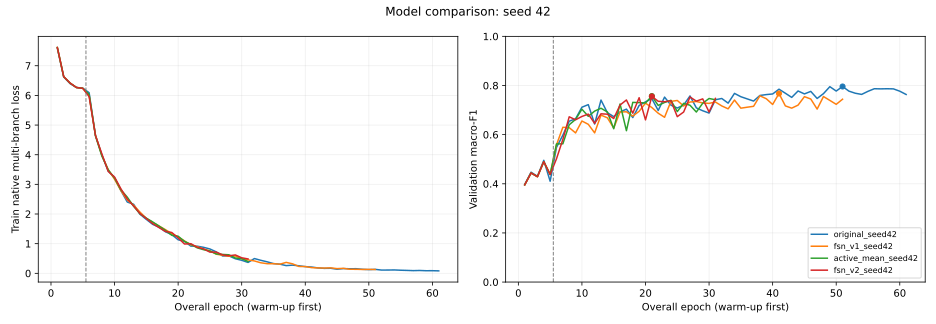

# FSN public experiment results

This directory is the canonical, privacy-sanitized result bundle for the FSN
action-recognition experiments.  It is intended for GitHub-connected ChatGPT
analysis and paper/reviewer preparation.

## Files

- `visual_model_comparison.json` — original, FSN-v1/v2, transfer diagnostics,
  best validation metrics, optimizer groups, class weights, and split audits.
- `sequence_per_seed.json` — complete baseline and FSN-v3 metrics for seeds
  42, 123, and 2026, including class, duration, and source slices.
- `three_seed_summary.json` — paired three-seed means, standard deviations,
  descriptive intervals, confusion directions, and acceptance checks.
- `audit_summary.json` — rejected phase-coverage and patch-trajectory
  hypotheses, checkpoint reproduction, and completion evidence.
- `manifest.json` — public bundle schema and exclusion policy.
- `learning_curves.json` — every epoch's native training loss, validation
  macro-F1, learning rate, phase, and best epoch for six visual training runs.
- `original_three_seeds.svg` — three Original training curves.
- `seed42_model_comparison.svg` — Original, FSN-v1, active-mean, and FSN-v2
  training curves under seed 42.

The training loss is Uni-AdaFocus's weighted multi-branch objective, rather
than final-head cross-entropy.  FSN-v3 uses the frozen Original visual model
and fits a transition table from training labels, so it shares Original's
neural-network training curve and has no separate epoch-wise train loss.

Detailed human-readable reports are available at:

- `reports/FSN_V3_VALIDATION_REPORT.md`
- `reports/FSN_V3_METRICS.md`

## Important interpretation

The 823 held-out clips are **validation**, because the derived protocol merged
the former train and validation splits and repurposed the former test split for
model selection.  There is no independent test set in these results.  Every
exported `test_metrics` value is therefore `null`.

FSN-v3 keeps the original Uni-AdaFocus visual model unchanged.  It estimates a
seven-state transition prior using training labels only and applies Viterbi
decoding to chronologically ordered clips from the same source record.
Singleton clips retain their independent visual prediction.

## Suggested ChatGPT request

> Read `public_results/fsn/latest/` and the two reports under `reports/` from
> branch `codex/fsn-v3` of `siyicheng0212-arch/FSN_REC`. Summarize the model
> comparison, three-seed metrics, per-class errors, source/duration slices,
> limitations, and reviewer-facing conclusions. Treat the 823 samples as
> validation, not an independent test set.

## Privacy boundary

The public bundle deliberately excludes videos, decoded frames, raw
annotations, absolute local/server paths, clip-level predictions, training
logs, and model checkpoints.
